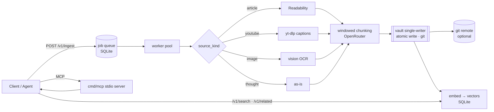

<div align="center">

# 🧠 GoBrain

**A self-hostable "second brain" backend.** Feed it YouTube links, articles, images, or raw thoughts — it runs an extract → chunk → enrich pipeline and files the results as clean Markdown into a **git-backed, semantically searchable vault** that any agent can read and write through MCP.

[](https://railway.com/deploy/hy7yIC?referralCode=r2pOPw)

`Go 1.23` · `SQLite (pure-Go, no CGO)` · `OpenRouter` · `MCP` · single static binary

</div>

---

## What it does

- **Ingests four source kinds** — articles (Readability), YouTube (yt-dlp captions → transcript), images (vision OCR, source image stored & embedded), and raw thoughts — on a bounded worker pool.
- **Files everything as [OKF](https://cloud.google.com/blog/products/data-analytics/how-the-open-knowledge-format-can-improve-data-sharing) Markdown** into a git-backed vault: YAML frontmatter, auto-generated `index.md` per directory, and per-tag hub pages for an Obsidian-navigable graph.
- **Semantic search + related notes** — every note is embedded (via OpenRouter); `/v1/search` ranks by meaning, `/v1/related` surfaces nearest neighbours, and each note gets an auto-generated `[[related]]` link block (Obsidian-navigable). Falls back to keyword search when no key is set, so it works either way.
- **Built-in web UI** — a zero-install, dark-mode-first browser UI is served right from the backend at `/`: capture, watch jobs get filed, and search your vault. No extra service, no separate deploy (see [Web UI](#web-ui)).
- **Shared with agents over MCP** — a stdio server lets Claude Code, Cursor, and friends read/write the same vault, so a team on different harnesses contributes to one brain.
- **Durable by design** — a single-writer goroutine owns all disk + git mutations (atomic writes, debounced commits, `rebase`-before-push, crash-recovery commit on boot).

## Architecture



## Get started

**Two ways to run it:**

- **Fastest — one-click deploy, nothing to install.** Hit the [**Deploy on Railway**](https://railway.com/deploy/hy7yIC?referralCode=r2pOPw) button; you only supply an `OPENROUTER_API_KEY`. Jump to [Deploy to Railway](#deploy-to-railway).
- **Run it locally / hack on it.** You'll need a few things installed **first**:
  - **[Go](https://go.dev/dl/) 1.23+** and **git** (required).
  - **[yt-dlp](https://github.com/yt-dlp/yt-dlp)** (`brew install yt-dlp`) — only if you want YouTube ingestion.
  - An **[OpenRouter](https://openrouter.ai) API key** — optional; enables AI chunking, image OCR, and semantic search. Without one, GoBrain still runs and falls back to keyword search.

## Quickstart (local)

```bash
go mod tidy
cp .env.example .env        # paste your OpenRouter key (optional — runs without it)

# 1. mint the first ADMIN token (bypasses HTTP auth to bootstrap the operator)
go run ./cmd/server mint "my laptop"
#   -> token (my laptop, admin): <64-hex secret>   ← store it, shown once

# 2. boot
go run ./cmd/server

# 3. ingest something
curl -sX POST localhost:8080/v1/ingest \
  -H "Authorization: Bearer <token>" -H "Content-Type: application/json" \
  -d '{"source_kind":"thought","payload":"wire up yt-dlp"}'

# 4. search it (semantic if a key is set, keyword otherwise)
curl -s 'localhost:8080/v1/search?q=video%20transcripts' -H "Authorization: Bearer <token>"
```

`yt-dlp` is needed for YouTube (`brew install yt-dlp`); the Docker image bundles it. The vault + DB live under `./data/` (gitignored) by default.

## Deploy to Railway

`railway.json` + the `Dockerfile` build a static binary with a `/healthz` check, so it's a few clicks:

1. **New Project → Deploy from GitHub repo** — Railway reads `railway.json` automatically.
2. **Add a Volume** mounted at **`/data`** — holds the SQLite DB + vault so they survive redeploys.
3. **Generate a domain** (Settings → Networking) — `BACKEND_URL` auto-derives from it.
4. **Set `OPENROUTER_API_KEY`**, and set **`BOOTSTRAP_ADMIN_TOKEN`** to a secret you generate (`openssl rand -hex 32`) — that becomes your admin token, no log-scraping needed.
5. Redeploy → use your `BOOTSTRAP_ADMIN_TOKEN` as the admin bearer token. (Alternatively set `BOOTSTRAP_ADMIN_LABEL` to have a random one printed to the deploy logs on first boot.)
6. **Connect your tools:** the [mobile app](#connect-the-mobile-app) (scan the QR) and your agent via the [MCP server](#mcp-server--share-the-vault-with-any-agent) (`claude mcp add …`).

> **Run a single instance (1 replica).** The single-writer vault + one volume must not be horizontally scaled.

**One-click:** the [**Deploy on Railway**](https://railway.com/deploy/hy7yIC?referralCode=r2pOPw) button at the top spins up a private instance — volume, healthcheck, and a generated admin token included. The deployer only supplies their own `OPENROUTER_API_KEY`.

## Web UI

Open your backend's URL in a browser (`http://localhost:8080` locally, or your Railway domain) and you get a built-in, single-page UI — no install, no separate deployment, served straight from the same binary:

- **Capture** a link, thought, or image URL (source kind is auto-detected).
- **Library** with a live summary (filed / filing / misfiled) and status that updates as jobs are filed.
- **Search** your vault (semantic when an OpenRouter key is set, keyword otherwise) and open any note.
- **Dark-mode first**, follows your OS theme with a manual Dark/Light toggle.

**Connecting** — there is no account or login. Paste an access token once; it's stored in that browser and sent as a bearer token on every request. Mint one with `server mint "my browser"` (or from an admin via `POST /v1/tokens`).

**Link the mobile app with a QR** — once connected, hit **Link phone** in the web UI. It shows a QR of the `secondbrain://join` deep link (built from this backend's URL + your token) — scan it with your phone and the GoBrain app opens and connects, no typing. The join link and the raw token are also shown with copy buttons, and **Invite a teammate** mints a fresh member token (admin only) so a whole team can onboard by scanning. (The QR encodes an access token — only share it with people you want writing to the vault, and the backend must be HTTPS for the app to accept it.)

### Connect the mobile app

The [GoBrain app](#gobrain-mobile-app) (iOS/Android) connects to the same backend — it just needs your backend URL + a token. Three ways, easiest first:

1. **Scan the QR.** In the app, tap **Scan QR to connect**, then point it at the **Link phone** QR in this web UI. Done.
2. **One-tap join link.** `POST /v1/tokens` (admin) returns a `join_link` — `secondbrain://join?url=<backend>&token=<raw-token>`. Open it on the phone and the app connects. (`BACKEND_URL` / `RAILWAY_PUBLIC_DOMAIN` must be set so the URL is complete.)
3. **Manual.** In the app's Connect screen, type your backend URL and paste a token.

> The backend must be served over **HTTPS** — iOS blocks plain `http://`. Railway domains are HTTPS by default.

## Routes

| Method | Path              | Auth   | Purpose                                   |
|--------|-------------------|--------|-------------------------------------------|
| GET    | `/healthz`        | none   | liveness probe                            |
| GET    | `/`               | none   | built-in web UI (token entered in-browser) |
| GET    | `/static/*`       | none   | web UI assets (embedded in the binary)    |
| —      | `/ui/*`           | member | web UI data fragments (htmx)              |
| POST   | `/v1/ingest`      | member | queue a job, returns `job_id`             |
| GET    | `/v1/status/{id}` | member | one job's status                          |
| GET    | `/v1/status`      | member | 50 most recent jobs                       |
| POST   | `/v1/notes`       | member | write a structured note                   |
| GET    | `/v1/notes/*`     | member | read a note by vault path                 |
| DELETE | `/v1/notes/*`     | member | delete a note (recoverable from git history) |
| GET    | `/v1/search?q=`   | member | **semantic** search (keyword fallback)    |
| GET    | `/v1/related?path=` | member | notes nearest to a given note           |
| POST   | `/v1/tokens`      | admin  | mint a token (`{label, role?}`) + join link |
| GET    | `/v1/tokens`      | admin  | list tokens (no secrets)                  |
| DELETE | `/v1/tokens/{id}` | admin  | revoke a token                            |

**Roles.** `member` = any valid token (capture + read). `admin` = also mint/list/revoke. The first token (`server mint` or `BOOTSTRAP_ADMIN_LABEL`) is admin.

## Configuration

Read from environment variables (`.env` is auto-loaded locally via `godotenv`; on Railway set service variables and it no-ops).

| Var                         | Default                        | Notes                                                            |
|-----------------------------|--------------------------------|------------------------------------------------------------------|
| `DB_PATH`                   | `/data/jobs.db`                | SQLite file                                                      |
| `VAULT_PATH`                | `/data/vault`                  | Markdown output root                                            |
| `PORT`                      | `8080`                         | listen port (Railway injects this)                              |
| `BACKEND_URL`               | *(auto)*                       | only for invite join-links; derives from `RAILWAY_PUBLIC_DOMAIN` |
| `BOOTSTRAP_ADMIN_TOKEN`     | —                              | install a chosen secret as the admin token (`openssl rand -hex 32`); use it directly, no log-scraping |
| `BOOTSTRAP_ADMIN_LABEL`     | —                              | alt: auto-mint a random admin to the logs on first boot         |
| `OPENROUTER_API_KEY`        | —                              | enables chunking, vision & semantic search; unset → offline/keyword fallback |
| `OPENROUTER_MODEL`          | `openai/gpt-4o-mini`           | text chunking model                                             |
| `OPENROUTER_VISION_MODEL`   | `openai/gpt-4o-mini`           | vision model for `image` OCR                                    |
| `OPENROUTER_EMBEDDING_MODEL`| `qwen/qwen3-embedding-8b`      | embeddings for semantic search + related notes                 |
| `YOUTUBE_AUDIO_FALLBACK`    | `false`                        | opt-in: transcribe a video's audio when it has no captions (off by default; needs the vars below) |
| `GROQ_API_KEY`              | —                              | ASR key for the audio fallback ([free](https://console.groq.com)); also honored via `TRANSCRIBE_API_KEY` |
| `TRANSCRIBE_MODEL`          | `whisper-large-v3-turbo`       | speech-to-text model for the audio fallback                    |
| `TRANSCRIBE_BASE_URL`       | `https://api.groq.com/openai/v1` | ASR provider endpoint; point at OpenAI or any Whisper-compatible API |
| `YTDLP_PROXY`               | —                              | route yt-dlp through a **residential** proxy so YouTube doesn't bot-block the server's datacenter IP; pay-as-you-go, ~pennies/video for captions |
| `YTDLP_COOKIES`             | —                              | alt to a proxy: Netscape `cookies.txt` contents from a logged-in session (free, but re-export periodically). `YTDLP_COOKIES_FILE` for a path |
| `RELATED_LINKS`             | `true`                         | auto-inject `[[related]]` blocks into notes; set `false` to disable body edits |
| `OPENROUTER_BASE_URL`       | `https://openrouter.ai/api/v1` | override for a proxy/self-host                                  |
| `VAULT_REPO_URL`            | —                              | git remote for the vault; unset → commits stay local           |
| `GIT_SSH_KEY`               | —                              | private deploy key for pushing to the remote                   |
| `GIT_AUTHOR_NAME` / `_EMAIL`| `secondbrain` / `…@localhost`  | commit identity                                                |

## MCP server — share the vault with any agent

`cmd/mcp` is a stdio [MCP](https://modelcontextprotocol.io) server: a thin, token-authed client over the backend so any MCP-capable agent contributes to one vault with consistent OKF structure, indexes, and git.

**Tools:** `search_vault` · `read_note` · `related_notes` · `write_note` · `delete_note` · `project_index`

It's a **local (stdio)** server that Claude launches as a process — it doesn't auto-detect anything, so you point it at **your** backend with two env vars: `SECONDBRAIN_URL` (your backend's URL) and `SECONDBRAIN_TOKEN` (a token you mint). Three one-time steps:

**1. Build the binary** (needs Go + this repo):
```bash
go build -o secondbrain-mcp ./cmd/mcp
```

**2. Mint a token** — from the web UI (**Invite a teammate**) or the admin API:
```bash
curl -X POST https://your-backend.up.railway.app/v1/tokens \
  -H "Authorization: Bearer <YOUR_ADMIN_TOKEN>" \
  -H "Content-Type: application/json" -d '{"label":"mcp"}'
# → { "token": "<use this>", ... }
```

**3. Register it with Claude.**

*Claude Code* — one command (`--scope user` makes it available in every project):
```bash
claude mcp add gobrain --scope user \
  -e SECONDBRAIN_URL=https://your-backend.up.railway.app \
  -e SECONDBRAIN_TOKEN=<the token from step 2> \
  -- /absolute/path/to/secondbrain-mcp
```
Then `claude mcp list` to confirm it's connected. Everything after `--` is the launch command; the `-e` values are the only place your URL and token live.

*Claude Desktop* — add to `claude_desktop_config.json` (Settings → Developer → Edit Config) and restart:
```json
{
  "mcpServers": {
    "gobrain": {
      "command": "/absolute/path/to/secondbrain-mcp",
      "env": {
        "SECONDBRAIN_URL": "https://your-backend.up.railway.app",
        "SECONDBRAIN_TOKEN": "<the token from step 2>"
      }
    }
  }
}
```

> **No paste-a-URL connector yet.** Because this is a stdio server, each user builds the binary and supplies their own URL + token — there's no auto-discovery. A one-click remote connector (add by URL, no local build) would need the MCP served over HTTP from the backend; not there yet.

## GoBrain mobile app

The backend already gives you a browser UI and a git-synced vault. The **GoBrain app** (iOS & Android) adds the one thing a browser can't: **capturing to your vault on the go.**

- **Share straight from your phone.** Hit Share on a YouTube video, an article, or a photo → **GoBrain** → it lands in your vault and gets filed while you carry on with your day.
- **Jot a thought the moment you have it**, from anywhere — it's in your second brain before you've put your phone down.
- **Watch it file, then search your whole vault** from your pocket — the same semantic search that's on the web.
- **Connect in one scan.** Open the web UI → **Link phone** → scan the QR from the app. No token typing.

**A one-time purchase — not a subscription.** You self-host the backend and your vault lives in *your own git repo*, so keeping it in sync across devices costs you nothing. The app is a single upfront payment: buy it once, own it, no monthly fees ever. For comparison, Obsidian charges roughly **$4/month** for its Sync add-on just to keep a vault in sync across devices — GoBrain gives you that for free (it's just git) and asks once for the app.

> The app talks only to **your** backend — GoBrain is not a hosted service and never sees your data or your keys. Bring your own backend, bring your own keys, own your knowledge.

*iOS App Store & Google Play — coming soon.*

## Layout

```
cmd/server/main.go     boot, graceful shutdown, `mint`, first-boot bootstrap
cmd/mcp/main.go        stdio MCP server (wraps the backend for any agent)
internal/api/          chi router, bearer-auth middleware, handlers
internal/web/          built-in htmx web UI (embedded templates + assets)
internal/store/        SQLite: jobs, hashed tokens (roles), embeddings, worker pool
internal/ingest/       ProcessJob: article/youtube/image/thought extraction + chunking
internal/note/         OKF renderer for direct agent-authored notes
internal/llm/          OpenRouter chat, vision & embeddings client
internal/index/        semantic index: reconcile, cosine search, related notes
internal/vault/        single-writer goroutine, git commit/rebase/push, read/search
```

## Development

```bash
go build ./...
go vet ./... && go test ./...
```
