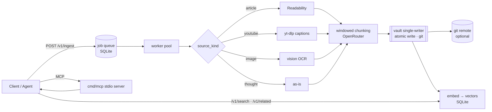

<div align="center">

# 🧠 GoBrain

**A self-hostable "second brain" backend.** Feed it YouTube links, articles, images, or raw thoughts — it runs an extract → chunk → enrich pipeline and files the results as clean Markdown into a **git-backed, semantically searchable vault** that any agent can read and write through MCP.

[](https://railway.com/deploy/hy7yIC?referralCode=r2pOPw)

`Go 1.23` · `SQLite (pure-Go, no CGO)` · `OpenRouter` · `MCP` · single static binary

</div>

---

## What it does

- **Ingests four source kinds** — articles (Readability), YouTube (yt-dlp captions → transcript), images (vision OCR, source image stored & embedded), and raw thoughts — on a bounded worker pool.
- **Files everything as [OKF](https://cloud.google.com/blog/products/data-analytics/how-the-open-knowledge-format-can-improve-data-sharing) Markdown** into a git-backed vault: YAML frontmatter, auto-generated `index.md` per directory, and per-tag hub pages for an Obsidian-navigable graph.
- **Semantic search + related notes** — every note is embedded (via OpenRouter); `/v1/search` ranks by meaning, `/v1/related` surfaces nearest neighbours, and each note gets an auto-generated `[[related]]` link block (Obsidian-navigable). Falls back to keyword search when no key is set, so it works either way.
- **Built-in web UI** — a zero-install, dark-mode-first browser UI is served right from the backend at `/`: capture, watch jobs get filed, and search your vault. No extra service, no separate deploy (see [Web UI](#web-ui)).
- **Shared with agents over MCP** — a stdio server lets Claude Code, Cursor, and friends read/write the same vault, so a team on different harnesses contributes to one brain.
- **Durable by design** — a single-writer goroutine owns all disk + git mutations (atomic writes, debounced commits, `rebase`-before-push, crash-recovery commit on boot).

## Architecture



## Quickstart (local)

```bash
go mod tidy
cp .env.example .env        # paste your OpenRouter key (optional — runs without it)

# 1. mint the first ADMIN token (bypasses HTTP auth to bootstrap the operator)
go run ./cmd/server mint "my laptop"
#   -> token (my laptop, admin): <64-hex secret>   ← store it, shown once

# 2. boot
go run ./cmd/server

# 3. ingest something
curl -sX POST localhost:8080/v1/ingest \
  -H "Authorization: Bearer <token>" -H "Content-Type: application/json" \
  -d '{"source_kind":"thought","payload":"wire up yt-dlp"}'

# 4. search it (semantic if a key is set, keyword otherwise)
curl -s 'localhost:8080/v1/search?q=video%20transcripts' -H "Authorization: Bearer <token>"
```

`yt-dlp` is needed for YouTube (`brew install yt-dlp`); the Docker image bundles it. The vault + DB live under `./data/` (gitignored) by default.

## Deploy to Railway

`railway.json` + the `Dockerfile` build a static binary with a `/healthz` check, so it's a few clicks:

1. **New Project → Deploy from GitHub repo** — Railway reads `railway.json` automatically.
2. **Add a Volume** mounted at **`/data`** — holds the SQLite DB + vault so they survive redeploys.
3. **Generate a domain** (Settings → Networking) — `BACKEND_URL` auto-derives from it.
4. **Set `OPENROUTER_API_KEY`**, and set **`BOOTSTRAP_ADMIN_TOKEN`** to a secret you generate (`openssl rand -hex 32`) — that becomes your admin token, no log-scraping needed.
5. Redeploy → use your `BOOTSTRAP_ADMIN_TOKEN` as the admin bearer token. (Alternatively set `BOOTSTRAP_ADMIN_LABEL` to have a random one printed to the deploy logs on first boot.)

> **Run a single instance (1 replica).** The single-writer vault + one volume must not be horizontally scaled.

**One-click:** the [**Deploy on Railway**](https://railway.com/deploy/hy7yIC?referralCode=r2pOPw) button at the top spins up a private instance — volume, healthcheck, and a generated admin token included. The deployer only supplies their own `OPENROUTER_API_KEY`.

## Web UI

Open your backend's URL in a browser (`http://localhost:8080` locally, or your Railway domain) and you get a built-in, single-page UI — no install, no separate deployment, served straight from the same binary:

- **Capture** a link, thought, or image URL (source kind is auto-detected).
- **Library** with a live summary (filed / filing / misfiled) and status that updates as jobs are filed.
- **Search** your vault (semantic when an OpenRouter key is set, keyword otherwise) and open any note.
- **Dark-mode first**, follows your OS theme with a manual Dark/Light toggle.

**Connecting** — there is no account or login. Paste an access token once; it's stored in that browser and sent as a bearer token on every request. Mint one with `server mint "my browser"` (or from an admin via `POST /v1/tokens`).

### Connect the mobile app

The companion Expo app (iOS/Android) connects to the same backend the same way — it just needs your backend URL + a token. Two paths:

1. **One-tap join link.** `POST /v1/tokens` (admin) returns a `join_link` of the form:
   ```
   secondbrain://join?url=https://your-backend.up.railway.app&token=<raw-token>
   ```
   Open that link on the device and the app connects in one tap. (`BACKEND_URL` / `RAILWAY_PUBLIC_DOMAIN` must be set so the URL is complete.)
2. **Manual.** In the app's Connect screen, enter your backend URL and paste a token minted by the backend.

> The backend must be served over **HTTPS** — iOS App Transport Security blocks plain `http://`. Railway domains are HTTPS by default.

## Routes

| Method | Path              | Auth   | Purpose                                   |
|--------|-------------------|--------|-------------------------------------------|
| GET    | `/healthz`        | none   | liveness probe                            |
| GET    | `/`               | none   | built-in web UI (token entered in-browser) |
| GET    | `/static/*`       | none   | web UI assets (embedded in the binary)    |
| —      | `/ui/*`           | member | web UI data fragments (htmx)              |
| POST   | `/v1/ingest`      | member | queue a job, returns `job_id`             |
| GET    | `/v1/status/{id}` | member | one job's status                          |
| GET    | `/v1/status`      | member | 50 most recent jobs                       |
| POST   | `/v1/notes`       | member | write a structured note                   |
| GET    | `/v1/notes/*`     | member | read a note by vault path                 |
| DELETE | `/v1/notes/*`     | member | delete a note (recoverable from git history) |
| GET    | `/v1/search?q=`   | member | **semantic** search (keyword fallback)    |
| GET    | `/v1/related?path=` | member | notes nearest to a given note           |
| POST   | `/v1/tokens`      | admin  | mint a token (`{label, role?}`) + join link |
| GET    | `/v1/tokens`      | admin  | list tokens (no secrets)                  |
| DELETE | `/v1/tokens/{id}` | admin  | revoke a token                            |

**Roles.** `member` = any valid token (capture + read). `admin` = also mint/list/revoke. The first token (`server mint` or `BOOTSTRAP_ADMIN_LABEL`) is admin.

## Configuration

Read from environment variables (`.env` is auto-loaded locally via `godotenv`; on Railway set service variables and it no-ops).

| Var                         | Default                        | Notes                                                            |
|-----------------------------|--------------------------------|------------------------------------------------------------------|
| `DB_PATH`                   | `/data/jobs.db`                | SQLite file                                                      |
| `VAULT_PATH`                | `/data/vault`                  | Markdown output root                                            |
| `PORT`                      | `8080`                         | listen port (Railway injects this)                              |
| `BACKEND_URL`               | *(auto)*                       | only for invite join-links; derives from `RAILWAY_PUBLIC_DOMAIN` |
| `BOOTSTRAP_ADMIN_TOKEN`     | —                              | install a chosen secret as the admin token (`openssl rand -hex 32`); use it directly, no log-scraping |
| `BOOTSTRAP_ADMIN_LABEL`     | —                              | alt: auto-mint a random admin to the logs on first boot         |
| `OPENROUTER_API_KEY`        | —                              | enables chunking, vision & semantic search; unset → offline/keyword fallback |
| `OPENROUTER_MODEL`          | `openai/gpt-4o-mini`           | text chunking model                                             |
| `OPENROUTER_VISION_MODEL`   | `openai/gpt-4o-mini`           | vision model for `image` OCR                                    |
| `OPENROUTER_EMBEDDING_MODEL`| `qwen/qwen3-embedding-8b`      | embeddings for semantic search + related notes                 |
| `RELATED_LINKS`             | `true`                         | auto-inject `[[related]]` blocks into notes; set `false` to disable body edits |
| `OPENROUTER_BASE_URL`       | `https://openrouter.ai/api/v1` | override for a proxy/self-host                                  |
| `VAULT_REPO_URL`            | —                              | git remote for the vault; unset → commits stay local           |
| `GIT_SSH_KEY`               | —                              | private deploy key for pushing to the remote                   |
| `GIT_AUTHOR_NAME` / `_EMAIL`| `secondbrain` / `…@localhost`  | commit identity                                                |

## MCP server — share the vault with any agent

`cmd/mcp` is a stdio [MCP](https://modelcontextprotocol.io) server: a thin, token-authed client over the backend so any MCP-capable agent contributes to one vault with consistent OKF structure, indexes, and git.

**Tools:** `search_vault` · `read_note` · `related_notes` · `write_note` · `delete_note` · `project_index`

```bash
go build -o secondbrain-mcp ./cmd/mcp
```

```json
{
  "mcpServers": {
    "secondbrain": {
      "command": "/path/to/secondbrain-mcp",
      "env": {
        "SECONDBRAIN_URL": "https://your-backend.up.railway.app",
        "SECONDBRAIN_TOKEN": "<a token minted by the backend>"
      }
    }
  }
}
```

## Layout

```
cmd/server/main.go     boot, graceful shutdown, `mint`, first-boot bootstrap
cmd/mcp/main.go        stdio MCP server (wraps the backend for any agent)
internal/api/          chi router, bearer-auth middleware, handlers
internal/web/          built-in htmx web UI (embedded templates + assets)
internal/store/        SQLite: jobs, hashed tokens (roles), embeddings, worker pool
internal/ingest/       ProcessJob: article/youtube/image/thought extraction + chunking
internal/note/         OKF renderer for direct agent-authored notes
internal/llm/          OpenRouter chat, vision & embeddings client
internal/index/        semantic index: reconcile, cosine search, related notes
internal/vault/        single-writer goroutine, git commit/rebase/push, read/search
```

## Development

```bash
go build ./...
go vet ./... && go test ./...
```
